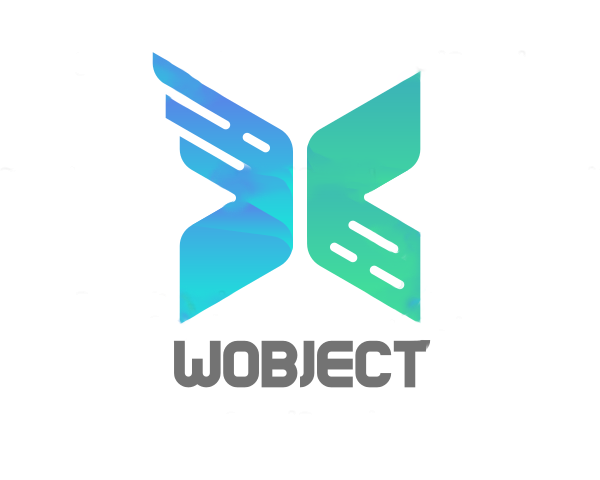
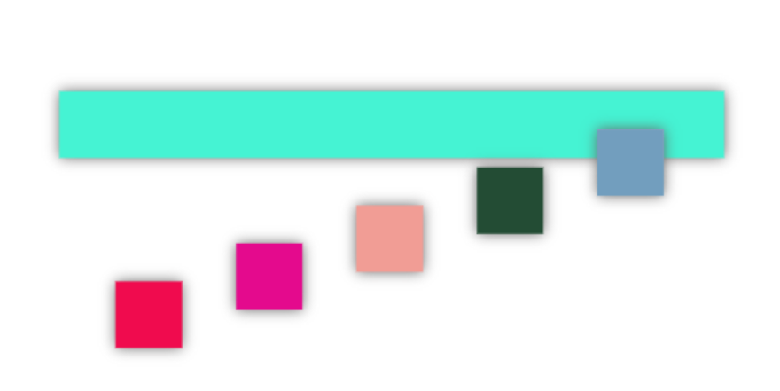
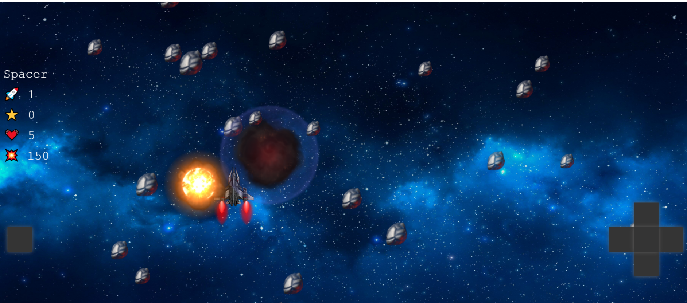
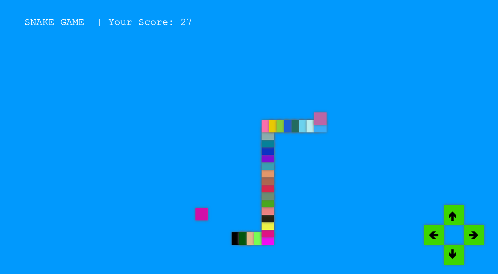

<div  align="center">



<h3>WObject - Web Object. </h3>
<blockquote>Typescript, OOP, Canvas based library for building UI Apps and 2D Games.</blockquote>
<p  align="center" >

<a  href="./">

<a  href="./LICENSE">

</p>

</div>

## ⭐️ Features

-  TypeScript
-  OOP
-  2D Game Engine
-  No Dependencies
-  HTML Canvas
-  Containers
-  Movements methods
-  Auto Collision system
-  Extendable Shapes components
-  Buttons system, Images, Sprite Animations ...

## 📦 Installation

### npm

```
npm i wobject

import WO from 'wobject'

```

## 💎 How to use

```javascript
//create the main app root
const app = new WO.Wobject.WOApp('myCanvas', 50);

//create a rectangle
let rect = new WO.Shapes.WORect(0, 0, 50, 50, '#b30');

// adding something to the tree (Rectangle wobject)
app.addElement(ButtonsObj);

app.run();
```

### 💣 Movements and Containers example



```javascript
import WO from 'wobject';
const app = new WO.Wobject.WOApp('myCanvas', 10);

let rect = new WO.Shapes.WORect(0, 0, 50, 50, WO.Utils.getRandomColor());
let rect1 = new WO.Shapes.WORect(0, 0, 50, 50, WO.Utils.getRandomColor());
let rect2 = new WO.Shapes.WORect(0, 0, 50, 50, WO.Utils.getRandomColor());
let rect3 = new WO.Shapes.WORect(0, 0, 50, 50, WO.Utils.getRandomColor());
let rect4 = new WO.Shapes.WORect(0, 0, 50, 50, WO.Utils.getRandomColor());

const container = new WO.Containers.WOHorizontalContainer(
   50,
   50,
   500,
   50,
   WO.Utils.getRandomColor()
);
container.setMargin(40, 0, 0, 0);

container.addElement(rect);
container.addElement(rect1);
container.addElement(rect2);
container.addElement(rect3);
container.addElement(rect4);
container.setMotionMethod(WO.Movements.moveInCircle(1, 0.07));

rect.setMotionMethod(WO.Movements.moveInCircle(6, 0.07));
rect1.setMotionMethod(WO.Movements.moveInCircle(5, 0.07));
rect2.setMotionMethod(WO.Movements.moveInCircle(4, 0.07));
rect3.setMotionMethod(WO.Movements.moveInCircle(3, 0.07));
rect4.setMotionMethod(WO.Movements.moveInCircle(2, 0.07));

app.addElement(container);
app.run();
```

[Play with the code](https://codesandbox.io/s/sharp-mayer-2es8p?file=/src/index.js)

## 🎮 What can you develop with WObject?

Check out this games that entirely have been build with WObject:



[Play the SpaceShip Game](https://wobject.netlify.app/apps/spaceship/)



[Play the Snake Game](https://wobject.netlify.app/apps/snakegame/)

[To the Source Code](./src/apps)

## 🚀 Run the examples

### npm

```
npm run-script start
```

### In the browser go to:

/spaceship
/snake

## ✅ Contributes are welcomed!
